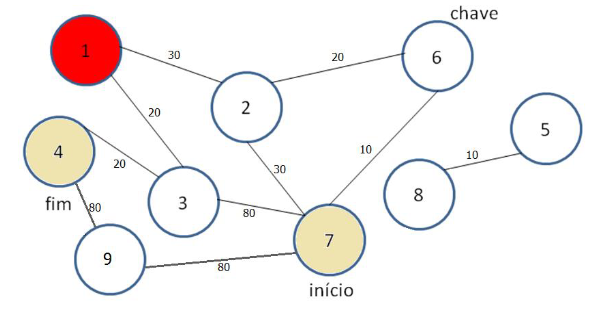

# ALGORITMOS E ESTRUTURAS DE DADOS II 
# Semestre 2023-1 - Exercício prático - Caminho em grafo
Este exercício programa consistiu em implementar o algoritmo de Dijkstra em C com algumas variações, como a existência de vértices "trancados".

## Contexto
Seja um ambiente virtual representado por um grafo não-dirigido ponderado formado por salas (vértices) e ligações
entre elas (arestas). Cada ligação é associada a um custo de deslocamento representado pelo peso da aresta. O ambiente deve ser
percorrido por um agente de software (e.g., um robô) a partir de uma sala marcada como início até a sala marcada como fim, que é
o objetivo final do agente. As salas podem estar trancadas ou não, e o acesso às salas trancadas só é permitido se o agente tiver
obtido previamente a chave de acesso. A chave dá acesso automático a todas as salas trancadas do ambiente, e ela é adquirida pelo
agente quando este passa pela sala marcada como chave.

## Descrição do EP
A partir do [modelo.txt](./etc/modelo.txt) disponibilizado, implementar a seguinte função caminho sobre uma
estrutura de dados do tipo grafo não dirigido ponderado:

  - NO *caminho(int N, int A, int *ijpeso, int *aberto, int início, int fim, int chave);

## Grafo de entrada
Os parâmetros N, A e o vetor ijpeso definem um grafo de N vértices e A arestas. Os vértices são numerados de
1 a N e as arestas são representadas pelo vetor ijpeso de tamanho 3 * A, contendo triplas na forma vértice origem i, vértice destino
j, peso. Por exemplo, dado A=2 e um vetor ijpeso={1,2,3,4,5,6}, o grafo em questão possui uma aresta entre os vértices 1 e 2 com
peso 3, e uma segunda aresta entre 4 e 5 com peso 6. Além disso, cada uma das N salas (vértices numerados 1..N) pode estar
aberta (1) ou fechada (0), conforme indicado pelo vetor de N elementos aberto (que contém apenas valores 0 e 1).

## Parâmetros do problema
Além da especificação do grafo em si, os inteiros início, fim e chave representam as salas com estas
respectivas funções.

## Saída
Um ponteiro do tipo NO* representando o caminho de menor custo possível de início até fim, i.e., um percurso válido de
salas adjacentes que não inclua acesso inválido a salas trancadas sem que a chave tenha sido previamente obtida, se for o caso.
O percurso pode ou não incluir a passagem pela chave. Se dois ou mais caminhos válidos possuírem custo mínimo, qualquer um deles pode ser retornado como resposta. O valor da sala chave pode eventualmente ser definido como sendo zero. Isso significa que não existe nenhuma chave naquele ambiente (mas ainda assim pode haver um ou mais caminhos possíveis que não dependam de chave). Note também que o caminho de custo mínimo pode ou não exigir a chave, ou seja, cabe ao algoritmo decidir se o melhor é pegar a chave ou não.

## Exemplo de grafo
Soluções possíveis:
  - {7, 3, 4}
  - {7, 6, 2, 1, 3, 4}

## Ambientes testados
  - VScode 1.78.2 | Pop!_OS 22.04 LTS | gcc 11.3.0
  - Code::Blocks 20.03 | Windows 10 22H2 | gcc 8.1.0